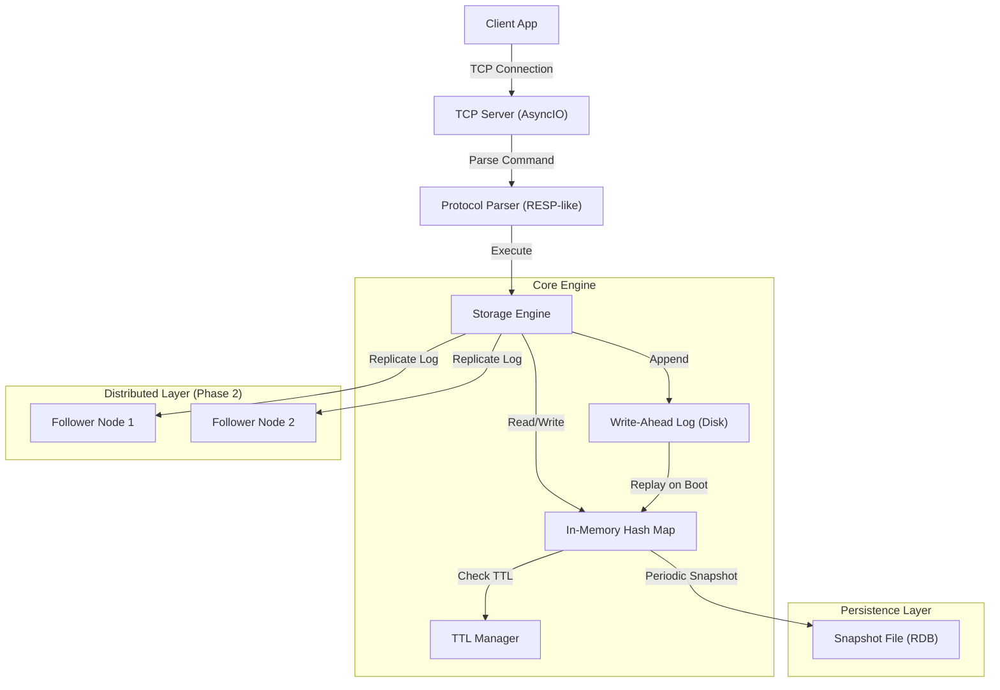

# Distributed Key-Value Store (Redis-Lite)


## Overview

A high-performance, distributed in-memory key-value store inspired by Redis and Dynamo. Built from scratch to demonstrate core backend engineering concepts including **TCP networking**, **Log-Structured Storage (LSM)**, **Write-Ahead Logging (WAL)** for durability, and **Leader-Follower Replication** for high availability.

This system is designed not just as a cache, but as a reliable data store capable of handling concurrent read/write loads with tunable consistency guarantees.

## Problem Statement

Building a reliable distributed database requires solving complex challenges:
*   **Concurrency:** Handling thousands of simultaneous client connections without blocking the main event loop.
*   **Durability:** Ensuring data survives process crashes using Append-Only Logs (AOL) or Snapshots.
*   **Availability:** Replicating state across nodes to tolerate node failures.
*   **Scalability:** Partitioning data (Sharding) to scale beyond a single machine's memory limit.

This project implements these distributed systems primitives from the ground up, avoiding high-level frameworks to showcase deep systems programming knowledge.

## Solution Architecture

The architecture mimics a production-grade KV store with distinct layers for networking, storage engine, and replication.



## Features

### 1. Core Data Operations (MVP)
*   **SET key value [TTL]**: Store string values with optional time-to-live.
*   **GET key**: Retrieve values in O(1) time.
*   **DEL key**: Remove specific keys.
*   **EXISTS key**: Check existence without retrieving payload.
*   **MGET key1 key2 ...**: Batch retrieval for reduced network RTT.

### 2. Advanced Storage Engine
*   **Thread-Safe Storage**: Uses fine-grained locking (or lock-free structures where applicable) to handle concurrent ops.
*   **TTL Management**: Lazy expiration strategy combined with a background sweeper to evict stale keys efficiently.
*   **Crash Recovery**: Hybrid durability using **WAL (Write-Ahead Log)** for every write and periodic **Snapshots** for faster startup.

### 3. Networking Protocol
*   **Custom TCP Protocol**: A lightweight text-based protocol similar to Redis Serialization Protocol (RESP).
*   **Pipelining**: Supports batching multiple commands in a single TCP packet to maximize throughput.

### 4. Distributed Systems (Phase 2)
*   **Replication**: Asynchronous leader-follower replication for read scaling and failover.
*   **Sharding**: Consistent Hashing ring to distribute keys across multiple nodes based on key hash.

## Tech Stack

*   **Language**: Python 3.11+
*   **Concurrency**: `asyncio` (Event Loop based networking)
*   **Storage**: In-memory Dicts + Append-Only File (AOF)
*   **Networking**: Low-level TCP Sockets (`asyncio.start_server`)
*   **Protocol**: Custom RESP-lite implementation

## Getting Started

### Prerequisites
*   Python 3.11+
*   Docker (optional for cluster mode)

### Installation

1.  Clone the repository:
    ```bash
    git clone https://github.com/manavanandani/distributed-kv-store.git
    cd distributed-kv-store
    ```

2.  Install dependencies (Minimal usage of external libs):
    ```bash
    pip install -r requirements.txt
    ```

3.  Start the Server:
    ```bash
    python -m src.server.main --port 6379
    ```

4.  Connect with Client (using `telnet` or provided CLI):
    ```bash
    telnet localhost 6379
    > SET mykey "Hello World"
    OK
    > GET mykey
    "Hello World"
    ```

## Roadmap

*   [x] **Phase 1 (MVP)**: TCP Server, In-Memory Store, Basic Commands (GET/SET/DEL).
*   [ ] **Phase 2 (Durability)**: Implement WAL (Write-Ahead Log) and Snapshotting.
*   [ ] **Phase 3 (Replication)**: Leader-Follower replication logic.
*   [ ] **Phase 4 (Sharding)**: Consistent Hashing and Request Routing.

## License
MIT License.
